# **Apache**

[Raúl Cubero Romero](https://github.com/raulcr2001)

## **Resumen**

En esta práctica hablaré sobre el **_Servidor Apache_** empezando por el origen del servidor y por último explicando paso a paso cómo se debe instalar y configurar correctamente.

## **Palabras Clave**

- _Apache_
- _Servidor_
- _HTTP_

## **Índice**

- [Introducción](#introducción)
- [Instalación de Apache](#instalación-de-apache)
    - [Más comandos que nos pueden servir](#más-comandos-que-nos-pueden-servir)
- [Configuración de Apache](#configuración-de-apache)
- [Bibliografía](#bibliografía)

## **Introducción**

[Apache](https://dinahosting.com/ayuda/que-es-apache-y-para-que-sirve/) es un servidor web [HTTP](https://es.wikipedia.org/wiki/Protocolo_de_transferencia_de_hipertexto) de código abierto creado en 1996 y actualmente es el servidor web más usado en todo el mundo debido a sus seguridad y estabilidad que está desarrollado y mantenido por una comunidad de usuarios en torno a la [Apache Software Foundation](https://httpd.apache.org/docs/2.4/es/).

## **Instalación de Apache**

En primer lugar, iniciamos el terminal y escribimos _sudo apt-get update_ , una vez hecho introducimos el siguiente comando.

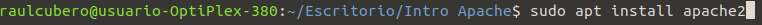

Cuando acabe la instalación, procedemos a configurar el cortafuegos, comenzaremos por listar las aplicaciones disponibles, solo nos interesa **Apache**.

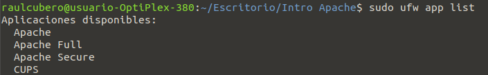

Habilitamos Apache...

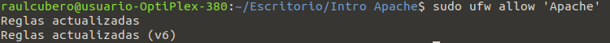

Realizamos un status para comprobar en qué estado se encuentra nuestro servidor.

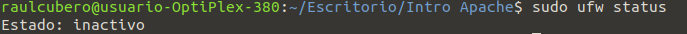

Con el siguiente comando, sabremos si nuestro servidor se encuentra iniciado y habilitado.

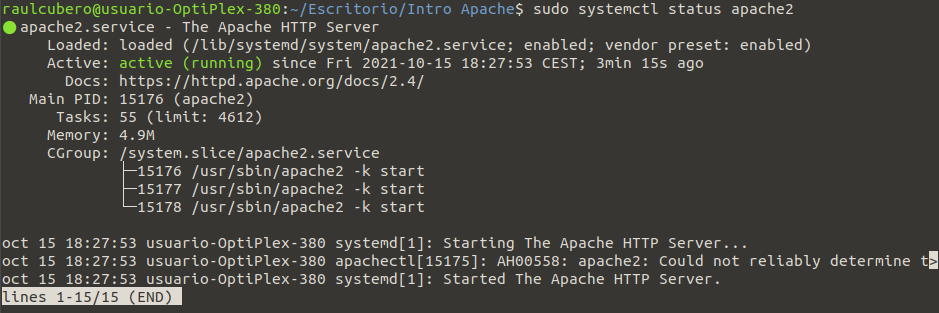

Una vez hechas todas las comprobaciones y todo funciona correctamente, procedemos a escribir el siguiente comando, el cual nos dará nuestra **_dirección IP_** para introducirla en nuestro navegador y poder visualizar **Apache**.

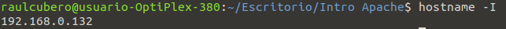

Introducimos la **_dirección IP_** en nuestro navegador y confirmamos que está todo bien.

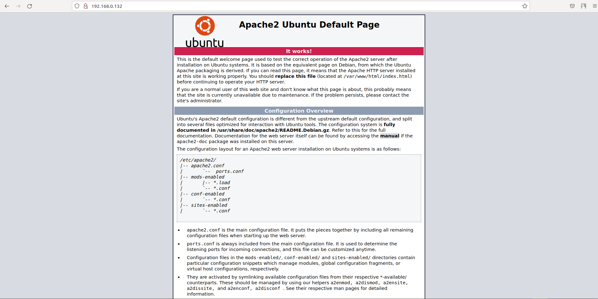

Para **_finalizar_**, introducimos el siguiente comando para parar el servidor y ya habremos acabado con la **_instalación_**.

### **Más comandos que nos pueden servir**

Para iniciar el servidor Apache **sudo systemctl start apache2**.

Reiniciar el servidor **sudo systemctl restart apache2**

Con el comando **sudo systemctl disable apache2** evitamos que **Apache** se inicie al encender el servidor.

Y con **sudo systemctl enable apache2** permitimos que se inicie al encender el servidor.

## **Configuración de Apache**

En primer lugar, crearemos la carpeta **_gci_** en el directorio **_/var/www/_**

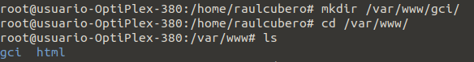

Una vez creada la carpeta, creamos un **_index.html_** y escribimos el siguiente código que será lo que se mostrará en nuestro navegador.

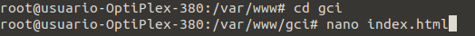

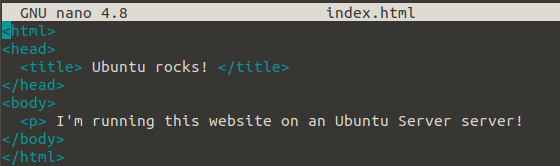

Una vez hayamos guardado, nos dirigimos al directorio **_/sites-available/_**, situado en **_/etc/apache2/_**

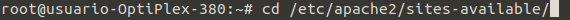

Ya dentro del directorio, introducimos el siguiente comando que nos sirve para copiar el **_.conf_** a uno nuevo que modificaremos para realizar esta práctica.

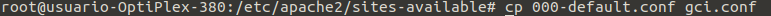

Cuando lo hayamos copiado, hacemos un **_nano_** del archivo para poder verlo y poder realizar todos los cambios que haya que hacer.

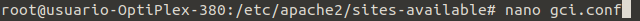

Cambiamos el **_DocumentRoot_** a la ruta donde se encuentra nuestro archivo, y en **_ServerName_** especifico qué hay que escribir en el navegador para visualizar el fichero.

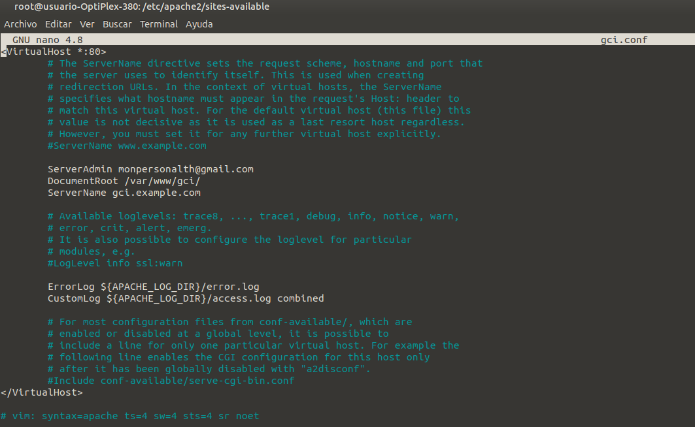

A continuación, activamos el archivo para poder verlo en el navegador con el siguiente comando.

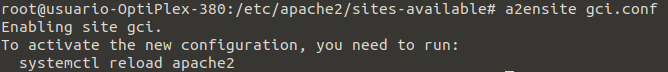

Después de activarlo, tendremos que realizar el siguiente comando para reiniciar el servidor y asegurarnos de que funciona bien.

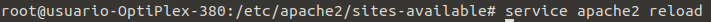

Entramos en la carpeta **_/etc/_** y modificamos el archivo **_hosts_** donde asociaremos nuestra **_loopback_** al **_ServerName_** que declaramos en el fichero anterior.

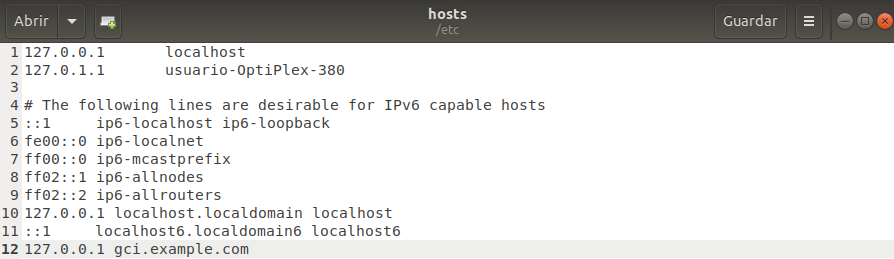

Escribimos el **_ServerName_** en nuestro navegador y confirmamos que va todo perfectamente, ya habríamos acabado la práctica.

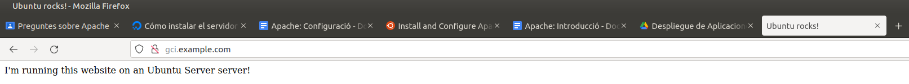

## **Bibliografía**

[Origen Servidor Apache](https://es.wikipedia.org/wiki/Servidor_HTTP_Apache)

[Install and configure Apache](https://ubuntu.com/tutorials/install-and-configure-apache#1-overview)

[Instalar el servidor web Apache en Ubuntu 20.04](https://www.digitalocean.com/community/tutorials/how-to-install-the-apache-web-server-on-ubuntu-20-04-es)
